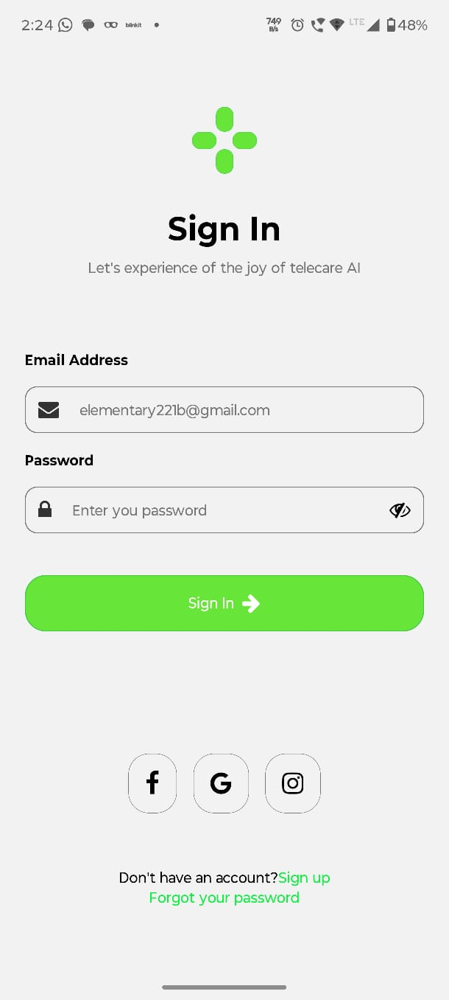

# AI Telecare Sign In UI

A React Native authentication UI inspired by a modern telemedicine/mobile healthcare design.

This project was built as part of my mobile development learning journey using **React Native + Expo**, focusing on reusable components, layout structuring, TypeScript basics, and mobile UI design principles.

---

# Preview

## Current UI

### App Screenshot



---

# Features

- Modern Sign In UI
- Reusable Input Component
- Dynamic FontAwesome Icons
- Password Visibility Toggle
- Responsive Flexbox Layout
- Component-Based Architecture
- TypeScript Prop Typing
- SafeAreaView Support
- Custom Logo Component

---

# Tech Stack

- React Native
- Expo
- TypeScript
- React Hooks
- Expo Vector Icons
- React Native Safe Area Context

---

# Project Structure

```bash id="’wini179"
components/
 ├── Logo.tsx
 ├── SignInHeader.tsx
 └── SignInInput.tsx

src/
 └── (app)/
      └── index.tsx
```

---

# What I Learned

This project helped me practice and understand:

- React Native fundamentals
- Flexbox layouts in mobile UI
- Reusable component design
- Props and state management
- Controlled TextInput components
- TypeScript basics in React Native
- `keyof typeof` typing patterns
- Icon integration using FontAwesome
- UI spacing and visual hierarchy
- Component composition

---

# Installation

Clone the repository:

```bash id="’wini180"
git clone <https://github.com/Rd-Sharma1/signInUi/>
```

Move into the project folder:

```bash id="’wini181"
cd <project-folder>
```

Install dependencies:

```bash id="’wini182"
npm install
```

Start the Expo development server:
Start the Expo development server:

```bash id="’wini183"
npx expo start
```

---

# Future Improvements

- Better mobile responsiveness
- Improved micro-interactions
- Form validation
- Navigation flow
- Authentication backend integration
- Dark mode support
- Animations and transitions

---

# UI Inspiration

Inspired by this Dribbble concept:

<https://dribbble.com/shots/24783022-osler-AI-Telehealth-Telemedicine-App-Sign-In-Sign-Up-UI>

---

# Status

Still improving and iterating as part of my React Native learning journey 🚀
